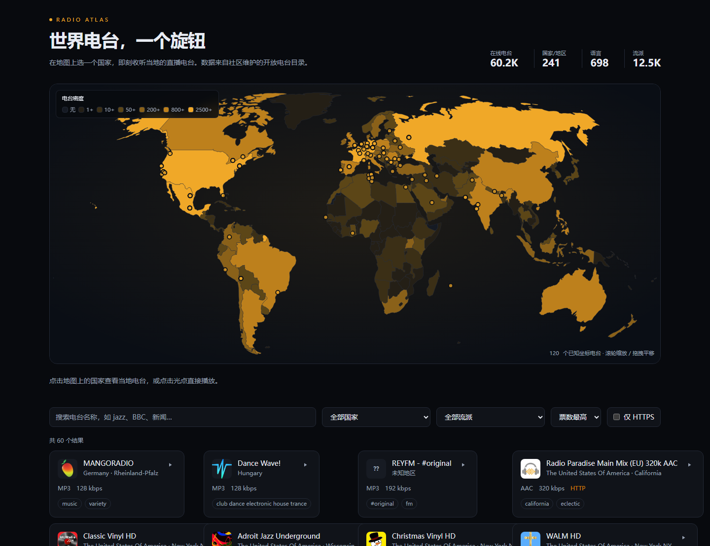

# RadioAtlas

**世界电台，一个旋钮。** 在世界地图上选一个国家，即刻收听当地的直播电台。



> 状态：`v0.2` — 数据层、播放内核、世界地图与基础排版已打通。

---

## 1. 这个项目解决什么

全球有数万个免费互联网电台流，但分散、失效率高、缺少统一的检索入口。
RadioAtlas 把它们收敛成一张**可点击的世界地图**：国家按电台密度着色，选中即听。

**数据源**：[Radio Browser](https://www.radio-browser.info/) —— 志愿者维护的开放电台目录。

| 指标 | 实测值（2026-10） |
| --- | --- |
| 在线电台 | 60,228 |
| 覆盖国家/地区 | 241 |
| 语言 | 698 |
| 流派标签 | 12,477 |
| 鉴权 | **无需 API Key** |
| 限速 | 建议 2–3 req/s |

---

## 2. 技术决策

| 决策 | 选择 | 理由 |
| --- | --- | --- |
| 框架 | **Next.js 16（App Router）+ React 19** | 服务端直连目录 API、SEO 友好、路由处理器可承载代理与缓存 |
| 语言 | **TypeScript（strict + `noUncheckedIndexedAccess`）** | 上游 API 字段多且可为空，需要类型兜底 |
| 样式 | **Tailwind CSS v4** | 零配置 `@theme`，暗色优先 |
| 音频 | **hls.js + 原生 `<audio>`** | 实测热门台大量为 `.m3u8`，原生 `<audio>` 除 Safari 外无法播放 |
| 地图 | **自绘 SVG**（`d3-geo` 投影 + `world-atlas` 国界） | 不依赖在线瓦片，暗色主题完全可控，离线可用 |
| 状态 | **React Context** | 全局单例播放器，跨路由不中断；避免为此引入状态库 |
| 测试 | **Vitest + Testing Library** | 与 Vite 生态一致，启动快 |
| 部署 | **Vercel**（推荐）/ 任意 Node 运行时 | 路由处理器需要 Node 侧出网 |

### 关键约束一：目录请求必须走服务端

1. **User-Agent**：Radio Browser 要求客户端标识自己，而浏览器**无法**通过 `fetch` 设置 `User-Agent`。只有服务端代理能满足。
2. **限速**：2–3 req/s 的软预算，必须集中做缓存，不能让每个用户直连。
3. **缓存**：服务端可做 TTL + `s-maxage`，把热查询压到近乎零上游请求。

### 关键约束二：`has_geo_info` 查询是线性全表扫描

这是设计地图时踩到的最大坑。实测同一接口不同行数的耗时：

| 请求行数 | 耗时 | 说明 |
| --- | --- | --- |
| 50 | 1.7s | |
| 120 | 2.9s | ← 全球光点层采用 |
| 150 | 8.2s | |
| 250 | 18.7s | |
| 600 | 25.9s | |
| 1500 | **>60s（超时）** | |

耗时随行数近似线性增长，**不是**网络问题。因此地图分成两层：

- **全球层**：只取 120 个光点（~3s），作为稀疏概览
- **国家层**：选中某国后按 `countrycode` 取 200 个（实测 CN 1.5s / DE 2.6s / FR 4.8s / US 6.2s）

两层都用 1 小时 TTL + `s-maxage=3600` 缓存，且**永不阻塞**电台列表 —— 光点加载失败时地图依然可用。

对照：不加 `has_geo_info` 的普通查询很快，但坐标覆盖率极低
（`topclick` 300 条仅 76 条有坐标，`bycountrycodeexact/CN` 300 条仅 7 条）。
所以「只查有坐标的」是唯一可行路径，代价就是慢。

### 关键约束三：点击排行被刷量污染

目录的 `clickcount` 计数器可被轻易刷高。实测同一时刻的全球点击排行前 10 名**全是尼日利亚电台**，
票数只有 38–466 却累计了 4000–6000 次点击：

| 排序 | 榜首 | 票数 | 点击 |
| --- | --- | --- | --- |
| `clickcount` | Sports Radio Brila FM (NG) | 219 | 6390 |
| `votes` | MANGORADIO (DE) | 826,695 | 605 |

因此**默认排序用 `votes`**，并且首页初始列表刻意不走 `/json/stations/topclick`
（它的排名就是点击排行）。`clickcount` / `clicktrend` 仍保留为可选排序，但标注为「点击最多」。

### 已知约束

- **混合内容**：大量电台仅有 `http://` 流，在 HTTPS 页面会被浏览器拦截。
  当前策略是暴露「仅 HTTPS」筛选开关 + 卡片上标注 `HTTP` 角标；后续可加**可选流代理**。
- **失效台**：目录中约 11% 的电台已下线。已默认 `hidebroken=true`，播放失败时 UI 明确提示。
- **地图光点覆盖不均**：只有 28 个中国台带地理坐标，而德国有 150+。这是上游数据本身的问题。

---

## 3. 架构与数据流

```
浏览器
  │  1. 页面 SSR
  ▼
Next.js Server Component ──► src/lib/radio-browser/queries.ts
  │                                │
  │                                ▼
  │                        src/lib/radio-browser/client.ts
  │                        （镜像轮询 de1 → nl1 → at1，超时 8s）
  │                                │
  │                                ▼
  │                        Radio Browser API  (60k+ 电台)
  │
  └─► src/lib/geo/countries.ts
        预投影国界 + 中文名 + 每国台数  →  <WorldMap /> 的 props

浏览器
  │  2. 交互检索（点击地图 / 筛选 / 搜索）
  ▼
GET /api/stations  ──► TtlCache（5 分钟）──► 命中即返回
GET /api/map       ──► TtlCache（1 小时）──► 命中即返回
                                            └─ 未命中 → 上游 → 回填缓存

浏览器
  │  3. 播放
  ▼
AudioPlayerProvider ──► .m3u8 ? hls.js : <audio src>
                            └─ 成功播放 → POST /api/click（回传点击，best-effort）
```

**镜像容错**：`de1` / `nl1` / `at1` 三台等价镜像依次尝试，任一返回 2xx JSON 即成功；
全部失败才抛 `RadioBrowserError`，并附带每一台的失败原因。

**地图坐标系**：国界与光点共用同一个 `geoNaturalEarth1` 投影（960×500 viewBox）。
投影参数在 `geo:build` 时固化进 `country-shapes.json`，服务端用它把经纬度投影成 viewBox 坐标后下发，
所以客户端**不需要任何地理库**。

---

## 4. 文件结构

```
.
├── .github/workflows/ci.yml        # typecheck → lint → test → build
├── scripts/
│   ├── build-geo-data.mjs          # npm run geo:build
│   └── verify-map-flow.mjs         # npm run verify:map（CDP 端到端冒烟）
├── src/
│   ├── app/
│   │   ├── layout.tsx              # 挂载全局播放器 Provider + PlayerBar
│   │   ├── page.tsx                # SSR 首页：站点头部 + 地图 + 电台列表
│   │   ├── globals.css             # Tailwind v4 @theme + 地图 SVG 原语
│   │   └── api/
│   │       ├── stations/route.ts   # 检索代理 + TTL 缓存 + 参数校验
│   │       ├── map/route.ts        # 地图光点（全局 / 按国家两档）
│   │       ├── countries/route.ts  # 国家列表（按台数降序）
│   │       ├── tags/route.ts       # 流派标签（Top 120）
│   │       └── click/route.ts      # 播放点击回传（POST，best-effort）
│   ├── components/
│   │   ├── AtlasExplorer.tsx       # 客户端总控：地图 + 筛选 + 结果
│   │   ├── map/WorldMap.tsx        # SVG 世界地图：密度填色 / 缩放平移 / 光点
│   │   ├── player/
│   │   │   ├── AudioPlayerProvider.tsx  # 单例 <audio> + HLS 切换 + 状态机
│   │   │   └── PlayerBar.tsx            # 底部固定播放条
│   │   ├── StationCard.tsx         # 电台卡片（favicon 降级、HLS/HTTP/离线角标）
│   │   └── StationGrid.tsx         # 响应式网格
│   ├── hooks/
│   │   └── useStations.ts          # 检索 hook，带请求中断
│   └── lib/
│       ├── radio-browser/
│       │   ├── types.ts            # PlayableStation / Station / Country / Tag
│       │   ├── client.ts           # 镜像容错、UA、超时、参数映射
│       │   ├── cache.ts            # 通用 TTL 缓存（可注入时钟）
│       │   └── queries.ts          # 读模型：搜索/热门/国家/标签/统计
│       ├── geo/
│       │   ├── country-shapes.json # 预投影国界（生成物，126 KB）
│       │   ├── country-meta.json   # 数字 ISO → alpha-2 + 中文名（生成物）
│       │   ├── countries.ts        # 三方 join：国界 + 名称 + 台数
│       │   ├── projection.ts       # 复现 geo:build 的投影，供光点使用
│       │   ├── viewport.ts         # 缩放/平移/取景的纯函数（可单测）
│       │   ├── density.ts          # 密度分档与配色
│       │   └── types.ts            # CountryShape / MapCountry / StationMarker
│       ├── audio/hls-loader.ts     # hls.js 动态加载与原生 HLS 探测
│       └── format.ts               # 展示层格式化与流地址解析
├── vitest.config.mts / vitest.setup.ts
├── next.config.ts / postcss.config.mjs / eslint.config.mjs / tsconfig.json
└── .env.example
```

---

## 5. API 端点

### `GET /api/stations`

| 参数 | 说明 | 默认 |
| --- | --- | --- |
| `q` | 电台名称模糊匹配 | — |
| `country` | ISO 3166-1 alpha-2，如 `CN` | — |
| `language` | 语言名 | — |
| `tag` | 流派标签 | — |
| `codec` | `MP3` / `AAC` / `OGG` | — |
| `bitrateMin` | 最低码率 kbps | — |
| `https` | `1` = 仅 HTTPS 流 | — |
| `order` | `clickcount` \| `clicktrend` \| `votes` \| `bitrate` \| `name` \| `random` | `clickcount` |
| `reverse` | `0` 关闭倒序 | `1` |
| `limit` | 1–200 | `60` |
| `offset` | 分页偏移 | `0` |

响应：`{ stations: Station[], total: number, cached: boolean }`，含 `Cache-Control: s-maxage=300`。

### `GET /api/map`

| 参数 | 说明 | 默认 |
| --- | --- | --- |
| `country` | ISO alpha-2；省略则返回全球稀疏层 | 全局 |
| `limit` | 20–300 | 全局 `120` / 按国 `200` |

响应：`{ markers: StationMarker[], scope: string }`。坐标已投影为 viewBox 值。
`s-maxage=3600`，上游超时放宽到 20s（见「关键约束二」）。

### `GET /api/countries` · `GET /api/tags`

返回参考数据，`s-maxage=3600`。

### `POST /api/click?uuid=<stationuuid>`

回传一次播放，保持目录排名可信。始终返回 `204`，失败静默。

---

## 6. 本地运行

```bash
# 1. 环境：Node >= 20.9
node -v

# 2. 安装
npm install

# 3. 配置（可选，但生产环境建议设置）
cp .env.example .env.local

# 4. 开发
npm run dev          # http://localhost:3000

# 5. 构建与生产
npm run build
npm start
```

### 脚本

| 命令 | 作用 |
| --- | --- |
| `npm run dev` | 开发服务器 |
| `npm run build` / `start` | 生产构建 / 启动 |
| `npm run geo:build` | 重新生成 `src/lib/geo/*.json`（国界 + 中文名） |
| `npm run verify:map` | 用无头 Chrome 走一遍「点击国家 → 缩放 + 换台」流程（需先 `npm run dev`） |
| `npm run typecheck` | `tsc --noEmit` |
| `npm run lint` | ESLint（Next 规则集） |
| `npm run test` | Vitest 单次运行 |
| `npm run test:watch` | Vitest 监听 |
| `npm run verify` | typecheck → lint → test → build 全链路 |

> `geo:build` 依赖 `world-atlas` / `world-countries` / `d3-geo` / `topojson-client`（均为 devDependencies）。
> 生成物已提交，所以**运行时不需要这些库**。切换分辨率时改脚本里的 `110m` 即可（`50m` 更精细，体积约 4 倍）。

---

## 7. 测试

覆盖**最容易悄悄坏掉**的部分，而不是追求覆盖率数字（共 66 个用例）：

| 文件 | 覆盖内容 |
| --- | --- |
| `client.test.ts` | URL 拼接与空值丢弃、参数 camelCase→snake_case 映射、UA 头、镜像回退（HTTP 错误 / 网络错误）、全失败时抛出带全部尝试记录的 `RadioBrowserError` |
| `cache.test.ts` | 存取、TTL 过期、单条 TTL 覆盖、LRU 淘汰、重复写入刷新新近度、清空 |
| `queries.test.ts` | 搜索默认值、**默认排序必须是 votes 且不得走 `topclick`**、调用方覆盖 |
| `viewport.test.ts` | 视口不被拖出画面（不变量：始终覆盖整个框）、`fitToBox` 居中与上限、`zoomAt` 保持光标下的点不动 |
| `density.test.ts` | 密度分档的每个边界值、索引不越界、配色端点 |
| `countries.test.ts` | 国界 + 中文名 + 台数的三方 join、空目录兜底、ISO 大小写、viewBox 常量 |
| `format.test.ts` | 标签切分与截断、`—` 兜底、数量缩写、流地址解析与 HTTP 不安全判定 |
| `hls-loader.test.ts` | `.m3u8`（含 query/hash、大小写）识别，`.m3u`/`.mp3` 不误判 |

```bash
npm run test
```

### 端到端冒烟

`npm run verify:map` 用 CDP 驱动无头 Chrome 走完整链路，并断言结果：

```
country paths rendered: 177
click CN: CLICKED
state: {"selectedIso2":"CN","zoomLabel":"重置 · 2.3×","resultLine":"共 60 个结果","markers":28}
```

需要先 `npm run dev`，且 Chrome 监听 9222 调试端口。

---

## 8. 路线图

**v0.3 — 播放健壮性**
- 可选流代理，解锁 HTTP-only 电台
- 失败自动重试 + 同国家备选台推荐
- MediaSession API（锁屏/耳机控制）

**v0.4 — 内容深度**
- 电台详情页（`/station/[uuid]`）+ 分享链接
- 收藏与最近播放（localStorage）
- 定时器 / 睡眠模式

**v0.5 — 国际化与可达性**
- i18n（zh / en），地图国名随语言切换
- 键盘导航与屏幕阅读器支持

---

## 9. 数据来源与致谢

- 电台数据：[Radio Browser](https://www.radio-browser.info/) — 社区维护，免费开放。
  本项目仅做检索与播放，**不重新分发**任何音频流；所有流均由各电台自行提供。
- 国界数据：[world-atlas](https://github.com/topojson/world-atlas)（Natural Earth，公有领域）。
- 国家元数据：[world-countries](https://github.com/mledoze/countries)（ODbL）。
- 若你运营电台或希望下架，请通过 Radio Browser 目录处理，本项目不做本地留存。

## 10. 许可

[MIT](./LICENSE)
